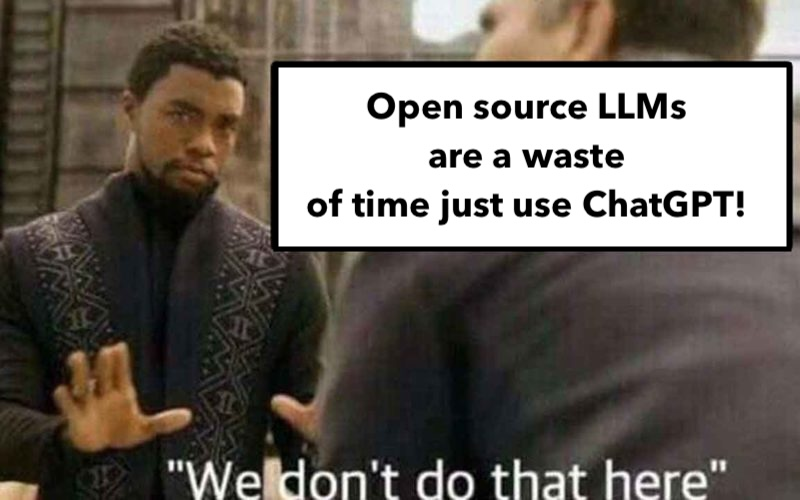

# Apple MLX for AI/Large Language Models—Day One

_Author: [Uche Ogbuji](https://ucheog.carrd.co/)_

I've been using llama.cpp on Mac Silicon for months now, and [my brother, Chimezie](https://huggingface.co/cogbuji) has been nudging me to give [MLX](https://github.com/ml-explore/mlx) a go.
I finally set aside time today to get started, with an eventual goal of adding support for MLX model loading & usage in [OgbujiPT](https://github.com/OoriData/OgbujiPT). I'd been warned it's rough around the edges, but it's been stimulating to play with. I thought I'd capture some of my notes, including some pitfalls I ran into, which might help anyone else trying to get into MLX in its current state.

As a quick bit of background I'll mention that MLX is very interesting because honestly, Apple has the most coherently engineered consumer and small-business-level hardware for AI workloads, with Apple Silicon and its unified memory. The news lately is all about Apple's AI fumbles, but I suspect their clever plan is to empower a community of developers to take the arrows in their back and build things out for them. The MLX community is already an absolute machine, a fact Chimezie spotted early on. If like me you're trying to develop products on this new frontier without abdicating the engineering to separate, black-box providers, MLX is a compelling avenue.



My initial forays will just be into inferencing, which should complement the large amount of solid community work in MLX fine-tuning and other more advanced topics. There's plenty of nuance to dig into just on the inference side, though.
As I was warned, it's clear that MLX is developing with great velocity, even by contemporary AI standards, so just as some resources I found from six weeks ago were already out of date, this could also well be by the time you come across it. I'll try to update and continue taking notes on developments as I go along, though.

First of all, I installed the mlx_lm package for Python, following the [instructions from HuggingFace](https://huggingface.co/docs/hub/en/mlx). After switching to a suitable Python virtual environment:

```sh
pip install mlx-lm
```

Later on, it became clear that I probably wanted to keep closer to the cutting edge, so I pulled from github instead:

```sh
git clone https://github.com/ml-explore/mlx-examples.git
cd mlx-examples/llms
pip install -U .
```

All I needed was a model to try out. On llama.cpp my go-to has been [OpenHermes-2.5-Mistral-7B](https://huggingface.co/teknium/OpenHermes-2.5-Mistral-7B), so my first move was to try to run that on MLX. I had read MLX gained limited GGUF model file format support recently, with limited support for quantization outputs. If this sentence has been gobbledygook to you,
I recommend you pause, [read this useful, llama.cpp-centered tutorial](https://christophergs.com/blog/running-open-source-llms-in-python), and come back. These concepts will be useful to you no matter what AI/LLM framework you end up using.

I naively just tried to load my already downloaded GGUF using `mlx_lm.load()`, but clearly wanted a `safetensors` distribution. I looked around some more and found the [GGUF](https://github.com/ml-explore/mlx-examples/tree/main/llms/gguf_llm) examples, but it was clear this was off the beaten path, and Chimezie soon told me the usual approach is to use MLX-specific models, which I can easily convert myself from regular model weights, or I can find pre-converted weights in the [mlx-community space](https://huggingface.co/mlx-community).
The first/obvious such repository I found matching OpenHermes-2.5-Mistral-7B was `mlx-community/OpenHermes-2.5-Mistral-7B`, but MLX refused to load it, and indeed it's an outdated model without  `safetensors`. It used the `.NPZ` format, which seems to be out of date and [yet is still referenced in the docs](https://ml-explore.github.io/mlx/build/html/examples/llama-inference.html#converting-the-weights).


A better choice turned out to be [`mlx-community/OpenHermes-2.5-Mistral-7B-4bit-mlx`](https://huggingface.co/mlx-community/OpenHermes-2.5-Mistral-7B-4bit-mlx).

```py
from mlx_lm import load, generate

model, tokenizer = load('mlx-community/OpenHermes-2.5-Mistral-7B-4bit-mlx')
```

The first time you run this load it will download from HuggingFace. The repository will be cached, by default in `~/.cache/huggingface/hub`, so subsequent loads will be much faster. Quick completion/generation example:

```py
response = generate(model, tokenizer, prompt="A fun limerick about four-leaf clovers is:", verbose=True)
```

You should see the completion response being streamed. I got a truly terrible limerick. Your mileage may vary.

You can also use [ChatML-style interaction](https://huggingface.co/docs/transformers/main/en/chat_templating):

```py
messages = [
  {'role': 'system', 'content': 'You are a friendly chatbot who always responds in the style of a talk show host'},
  {'role': 'user', 'content': 'Do you have any advice for a fresh graduate?'}]
chat_prompt = tokenizer.apply_chat_template(messages, tokenize=False)
response = generate(model, tokenizer, prompt=chat_prompt, verbose=True)
```

`response` is the plain old string with the LLM completion/response. It will already have been streamed to the console thanks to `verbose=True`, right after the converted prompt, displayed so you can see how the ChatML format has been converted using special, low-level LLM tokens such as `<|im_start|>` & `<|im_end|>` (more on LLM tokens in a future article). Having the system message in the chat prompting and all that definitely, by my quick impressions, made the interactions far more coherent.


That's as far as I got in a few hours of probing yesterday, but as I said, I'll keep the notes coming as I learn more. Next I plan to start thinking about how to incorporate what I've learned into OgbujiPT.

Plug: As I've suggested, Chimezie has blazed this trail before me, and was quite helpful. You can check out the work he's already shared with the MLX community, such as his [Mr. Grammatology medical/clinical LLM fine-tune](https://huggingface.co/cogbuji/Mr-Grammatology-clinical-problems-Mistral-7B-0.5), and [mlx-tuning-fork](https://github.com/chimezie/mlx-tuning-fork), his framework for (Q)LoRa fine-tuning with MLX. [His work is featured in the brand new Oori Data HuggingFace organization page.](https://huggingface.co/OoriData).