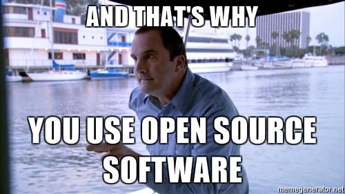

# Converting models from Hugging Face to MLX format, and sharing

_Author: [Uche Ogbuji](https://ucheog.carrd.co/)_

Since my [first article on dipping my toes into MLX](https://github.com/uogbuji/mlx-notes/blob/main/2024/MLX-day-one.md) I've had several attention swaps, but a trip to Cleveland for prime eclipse viewing in totality gave me a chance get back to the framework. Of course the MLX team and community keep marching on, and there have been several exciting releases, and performance boosts, since my last look-in.

At the same time, coincidentally, a new small model was released which I wanted to try out. [H2O-Danube2-1.8b, and in particular the chat version](https://huggingface.co/h2oai/h2o-danube2-1.8b-chat) debuts at #2 in the "~1.5B parameter" category on the [Open LLM Leaderboard](https://huggingface.co/spaces/HuggingFaceH4/open_llm_leaderboard), which is promising. It was then only available in Hugging Face weight format, so I needed to convert it for MLX use.

I'll use this new model to explore how easy it is to convert Hugging Face weights to MLX format, and to share the results, if one chooses to do so.

 [source](https://science.nasa.gov/eclipses/future-eclipses/eclipse-2024/what-to-expect/)

## Preparation and conversion

First of all I upgraded the MLX versions in the virtual environment I was using

```sh
pip install -U mlx mlx-lm
```

If you do so, and in the unlikely event that you don't end up with the latest versions of packages after this, you might want to add the ` --force-reinstall` flag.

I created a directory to hold the converted model

```sh
mkdir -p ~/.local/share/models/mlx
mkdir ~/.local/share/models/mlx/h2o-danube2-1.8b-chat
```

Used the command line for the actual conversion

```sh
python -m mlx_lm.convert --hf-path h2oai/h2o-danube2-1.8b-chat --mlx-path ~/.local/share/models/mlx/h2o-danube2-1.8b-chat -q
```

This took around ten and a half minutes of wall clock time—downloading and converting. The `-q` option quantizes the weights while converting them. The default quantization is to 4 bits (from the standard Hugging Face weight format of 16-bit floating point), but you can choose a different result bits per weight, and other quantization parameters with other command line options.

It's good to be aware of the model type and architecture you're dealing with, which doesn't change when you convert weights to MLX. Eyeballing the [h2o-danube2-1.8b-chat config.json](https://huggingface.co/h2oai/h2o-danube2-1.8b-chat/blob/main/config.json), I found the following useful bits:

```json
  "architectures": [
    "MistralForCausalLM"
  ],
  …
  "model_type": "mistral",
```

Luckily Mistral-style models are well supported, thanks to their popularity.

# Loading and using the converted model from Python

I loaded the model from local directory

```py
from mlx_lm import load, generate
from pathlib import Path

model_path = Path.home() / Path('.local/share/models/mlx') / Path('h2o-danube2-1.8b-chat')
model, tokenizer = load(model_path)
```

This led to a warning

> You set `add_prefix_space`. The tokenizer needs to be converted from the slow tokenizers

Some digging into the Hugging Face transformers library, from whence it originates, yielded no easy answers as to how seriously to take this warning.

First ran the model using a similar pattern to the example in the last article, but it tripped up on the chat format.

```py
messages = [
  {'role': 'system', 'content': 'You are a friendly and informative chatbot'},
  {'role': 'user', 'content': 'There\'s a total solar eclipse tomorrow. Tell me a fun fact about such events.'}]
chat_prompt = tokenizer.apply_chat_template(messages, tokenize=False)
response = generate(model, tokenizer, prompt=chat_prompt, verbose=True)
```

I got `TemplateError: System role not supported`. Not all chat models are trained/fine-tuned with the system role. If you try to set system messages but the Hugging Face tokenizer doesn't recognize system role support, it sends a strong signal through this exception. Much better than silently confusing the model. There is no universal workaround for this—it all comes down to details of how the model was trained. I didn't do a lot of investigation of the H2O Danube 2 chat template. Instead I just basically slammed the system prompt into the user role.

```py
from mlx_lm import load, generate
from pathlib import Path

model_path = Path.home() / Path('.local/share/models/mlx') / Path('h2o-danube2-1.8b-chat')
model, tokenizer = load(model_path)  # Issues a slow tokenizer warning

SYSTEM_ROLE = 'user'
messages = [
  {'role': SYSTEM_ROLE, 'content': 'You are a friendly and informative chatbot'},
  {'role': 'user', 'content': 'There\'s a total solar eclipse tomorrow. Tell me a fun fact about such events.'}]
chat_prompt = tokenizer.apply_chat_template(messages, tokenize=False)
response = generate(model, tokenizer, prompt=chat_prompt, verbose=True)
```

The generation felt faster than last article's run on OpenHermes/Mistral7b, and indeed the reported numbers were impressive—running on a 2021 Apple M1 Max MacBook Pro (64GB RAM):

```
Prompt: 84.037 tokens-per-sec
Generation: 104.326 tokens-per-sec
```

Back of the envelope says that's 3-4X faster prompt processing and 2-3X faster generation. Some of that is the fact that H2O-Danube2 is around 4X smaller, but some of it is down to improvements in the MLX code.


# Uploading converted models to Hugging Face

Unlike the example above, you'll often find that models have been converted to MLX weights for you already. This is of course the beauty of an open-source community. If you do convert a model yourself, you can be part of the sharing spree.

## Preparing for upload

You'll need an account on Hugging Face, then an access token with write permissions. Copy one from [your tokens settings](https://huggingface.co/settings/tokens) into your clipboard (and password manager). Install the Hugging Face tools

```sh
pip install -U huggingface_hub
```

Run `huggingface-cli login` and paste the token you copied earlier. You're now ready for the upload. It will push everything in your local folder with the converted weights, so you should probably check that it's ready for the public. At a minimum add a `README.md` (more on this below) and look over the `config.json`, making sure there is at least a `"model_type"` key. In this case, it's unchanged from the original: `"model_type": "mistral"`. Browsing other, recent model repositories for the [`mlx-community`](https://huggingface.co/mlx-community) is a good way to get a sense of what your upload should contain.

### README.md

You'll want to have a README.md file, from which the Hugging Face model card and some metadata are extracted. I started with the metadata from the original model. It's MDX format, which is markdown with metadata headers and optional inline instructions. The [original model's metadata headers are as follows](https://huggingface.co/h2oai/h2o-danube2-1.8b-chat/raw/main/README.md):

```markdown
---
language:
- en
library_name: transformers
license: apache-2.0
tags:
- gpt
- llm
- large language model
- h2o-llmstudio
thumbnail: >-
  https://h2o.ai/etc.clientlibs/h2o/clientlibs/clientlib-site/resources/images/favicon.ico
pipeline_tag: text-generation
---
```

I added some descriptive information about the model and how to use it in MLX. This information becomes the Hugging Face model card for the upload.

## Upload

[Hugging Face repositories are basically git and git-LFS](https://huggingface.co/docs/huggingface_hub/guides/upload), so you have many ways of interacting with them. In my case I ran a Python script:

```py
from huggingface_hub import HfApi, create_repo
from pathlib import Path

model_path = Path.home() / Path('.local/share/models/mlx') / Path('h2o-danube2-1.8b-chat')

repo_id = create_repo('h2o-danube2-1.8b-chat-MLX-4bit').repo_id
api = HfApi()
api.upload_folder(folder_path=model_path,
                  repo_id=repo_id,
                  repo_type='model',
                  multi_commits=True,
                  multi_commits_verbose=True)
```

Notice how I set the destination `repo_id` within my own account `ucheog`. Eventually I may want to share models I convert within the MLX community space, where others can more readily find it. In such a case I'd set `repo_id` to something like `mlx-community/h2o-danube2-1.8b-chat`. Since this is my first go-round, however, I'd rather start under my own auspices. To be frank, models available on `mlx-community` are a bit of a wild west grab-bag. This is the yin and yang of open source, of course, and we each navigate the bazaar in our own way.

The `multi_commits` flags use a pull request & stage the upload piece-meal, which e.g. allows better recovery from interruption.



# Wrap up

You've had a quick overview on how to convert Hugging Face weights to MLX format, and how to share such converted models with the public. As it happens, [another MLX community member converted and shared h2o-danube2-1.8b-chat](https://huggingface.co/mlx-community/h2o-danube2-1.8b-chat-4bit) a few days after I posted my own version, and you should probably use that one, if you're looking to use the model seriously. Nevertheless, there are innumerable models out there, a very small proportion of which has been converted for MLX, so it's very useful to learn how to do so for yourself.

# Additional resources

* [Hugging Face hub docs on uploading models](https://huggingface.co/docs/hub/en/models-uploading)
* [Hugging Face/Transformers docs on sharing models](https://huggingface.co/docs/transformers/model_sharing) - more relevant to notebook & in-Python use
* Chat templating is a very fiddly topic, but [this Hugging Face post](https://huggingface.co/blog/chat-templates) is a useful intro. They do push Jinja2 hard, and there's nothing wrong with Jinja2, but as with any tool I'd say use it if it's the right one, and not out of reflex.
