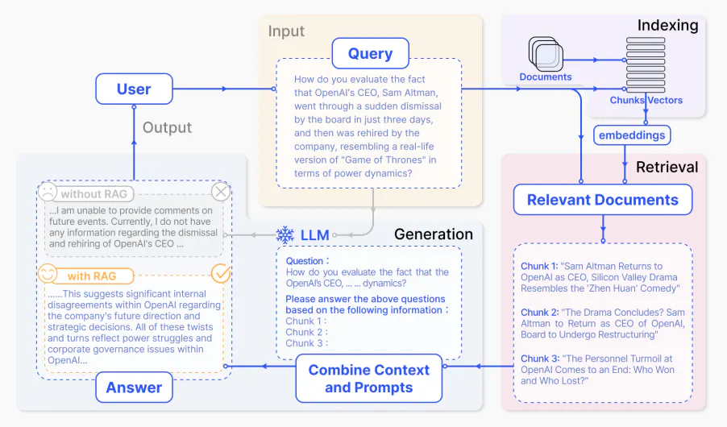
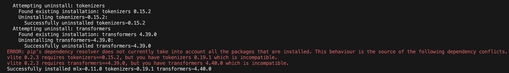
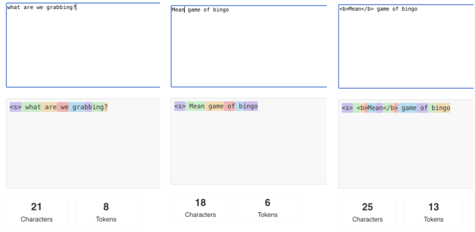

# Retrieval augmentation with MLX: A bag full of RAG, part 1

_Author: [Uche Ogbuji](https://ucheog.carrd.co/)_

After the intial fun with LLMs, asking the capital of random countries and getting them to tell lousy jokes or write wack poems, the next area I've found people trying to figure out is how to "chat their documents". In other words, can you give an LLM access to some documents, databases, web pages, etc. and get them to use that context for more specialized discussion and applications? This is more formally called Retrieval Augmented Generation (RAG).

As usual I shan't spend too much time explaining fundamental AI principles in these articles which are focused on the MLX framework. For a very high level view of RAG, see [this synopsis from the Prompt Engineering Guide](https://www.promptingguide.ai/techniques/rag), or better yet, see [this full article from the same source](https://www.promptingguide.ai/research/rag). The latter is a long read, but really important if you're trying to advance from baby steps to almost any sophisticated use of LLMs. In any case, you'll need to understand at least the basics of RAG to get the most of this article.

### RAG application workflow (Source: [Gao et al.](https://arxiv.org/abs/2312.10997))



In this article I'll show through code examples how you can start to build RAG apps to work with LLM generation on MLX. It's a big subtopic, even just to get through the basics, so I'll break it into two parts, the first of which focuses on the retrieval portion.

# Trying out a vector DBMS

So far in these articles the main benefit of MLX has been GenAI accelerated on Apple Silicon's Metal architecture. That's all about the "G" in RAG. It would be great to have the "R" part also taking some advantage of Metal, but that proves a bit tougher than I'd expected. Many of the best-known vector DBs (faiss, qdrant, etc.) use various techniques to accelerate embedding and perhaps lookup via GPU, but they focus on Nvidia (CUDA) and in some cases AMD (ROCm), with nothing for Metal.

Following a hint from [Prince Canuma](https://huggingface.co/prince-canuma) I found [vlite—"a simple and blazing fast vector database"](https://github.com/sdan/vlite) whose docs include the promising snippet:

> - `device` (optional): The device to use for embedding ('cpu', 'mps', or 'cuda'). Default is 'cpu'. 'mps' uses PyTorch's Metal Performance Shaders on M1 macs, 'cuda' uses a NVIDIA GPU for embedding generation.

_Spoiler: I ended up abandoning vlite for reasons I'll cover, so feel free to not botgher trying any of the code examples until you get to the section "Using the Qdrant vector DBMS via OgbujiPT"._

Installing vlite

```sh
pip install -Ur https://raw.githubusercontent.com/sdan/vlite/master/requirements.txt
pip install "vlite[ocr]"
```

With the `[ocr]` modifier the vlite package is installed as well as helper packages for pulling text from PDF documents in the database. In my case I ran into pip errors such as the following.



These sorts of conflicting dependencies are a common annoyance in the AI space, especially with widely-used and fast-evolving packages such as transformers, tokenizers, pytorch, pydantics and such.

If you don't need all the added PDF tools you can install just vlite by taking out the `[ocr]` modifier from the `pip` command.

## Ever more resources

We need content to add to the database. I've made it easy by providing the markdown of articles in thei MLX notes series (including this article). You can [download them from Github](https://github.com/uogbuji/mlx-notes/assets/resources/2024/ragbasics/files), the whole directory, or just the contained files, and put them in a location you can refer to in the code later.

Build your vlite vector database from those files by running the code in listing 1, which I've also [provided as a download from Github](https://github.com/uogbuji/mlx-notes/assets/resources/2024/ragbasics/listings). Make sure you first give it a look and perhaps update the `CONTENT_FOLDER` and `COLLECTION_FPATH` values.

### Listing 1 (vlite_build_db.py): Building a vlite vector database from markdown files on disk

```py
# vlite_build_db.py
import os
from pathlib import Path

from vlite import VLite
from vlite.utils import process_txt

# Needed to silence a Hugging Face tokenizers library warning
os.environ['TOKENIZERS_PARALLELISM'] = 'false'

TEXT_SUFFIXES = ['.md', '.txt']
# 
CONTENT_FOLDER = Path('assets/resources/2024/ragbasics/files')
# Path to a "CTX" file which is basically the vector DB in binary form
COLLECTION_FPATH = Path('/tmp/ragbasics')

def setup_db(files, collection):
    # Create database
    # If you don't specify a "collection" (basically a filename), vlite will create
    # a file, using the current timestamp. under "contexts" in the current dir
    # device='mps' uses Apple Metal acceleration for the embedding,
    # which is typically the most expensive stage
    vdb = VLite(collection=collection, device='mps')

    for fname in files.iterdir():
        if fname.suffix in TEXT_SUFFIXES:
            print('Processing:', fname)
            vdb.add(process_txt(fname))
        else:
            print('Skipping:', fname)
    return vdb

vdb = setup_db(CONTENT_FOLDER, COLLECTION_FPATH)
vdb.save()  # Make sure the DB is up to date
```

First time you run this, you might get a long delay while it downloads and caches models needed for embeddings and the like (especially `onnx/model.onnx`). Again this is a common rigamarole with ML projects.

# Retrieving from the vector DB

Vlite takes a very raw and lightweight approach to vector database management. You can save embedded and otherwise indexed data to what it calls context files, which can later on be loaded for update or querying.

Listing 2 loads the context file saved in the previous section (`/tmp/ragbasics.ctx`) and then tries to retrieve a snippet of text from one of these MLX articles.

### Listing 2 (vlite_retrieve.py): Retrieving content from a vlite vector database on disk

```py
# vlite_retrieve.py
from pathlib import Path

from vlite import VLite

COLLECTION_FPATH = Path('/tmp/ragbasics')

vdb = VLite(collection=COLLECTION_FPATH, device='mps')

# top_k=N means take the N closest matches
# return_scores=True adds the closeness scores to the return
results = vdb.retrieve('ChatML format has been converted using special, low-level LLM tokens', top_k=1, return_scores=True)
print(results[0])
```

When I first tried this, the results were terrible. RAG is always trickier than you may think, and there are many considerations to designing an effective RAG pipeline. One key one is how the content is partitioned within the vector DB, because each query will try to match and respond with particular chunks of text based on the query. By default vlite takes a naive approach of creating sequential chunks with up to 512 token length.

## Wait, what are tokens again?

Tokens have come up before in this series, and you might be wondering. "What are those, exactly?" Tokens are a really important concept with LLMs. When an LLM is dealing with language, it doesn't do so character by character, but it breaks down a given language into statistically useful groupings of characters, which are then identified with integer numbers. For example the characters "ing" occur pretty frequently, so a tokenizer might group those as a single token in many circumstances. It's sensitive to the surrounding character sequence, though, so the word "sing" might well be encoded as a single token of its own, regardless of containing "ing".

The best way to get a feel of LLM tokenization is to play around with sample text and see how it gets converted. Luckily there are many tools out there to help, including [the simple llama-tokenizer-js playground](https://belladoreai.github.io/llama-tokenizer-js/example-demo/build/) web app which allows you to enter text and see how the popular Llama LLMs would tokenize them.



The colors don't mean anything special in themselves. They're just visual tiling to separate the tokens. Notice how start of text is a special token `<s>`. You might remember we also encountered some other special tokens such as `<|im_start|>` (begin conversation turn) in previous articles. LLM pre-training and fine-tuning changes the way things are tokenized, as part of setting the entire model of language. Llama won't tokenize exactly as, say ChatGPT does, but the basic concepts stay the same.

The picture shows an example of how markup such as HTML can affect tokenization. There are models such as the commercial [Docugami](https://www.docugami.com/) which are trained towards efficient tokenization of markup. Code-specialized LLMs such as those used in programmer copilot tools would have efficient tokenizations of the sorts of constructs which are more common in programming code than in natural language.

## Creating more sensible chunks

In effect, the tokenization establishes the shape of language in a model. As such, it makes some sense, if you absolutely know no better, to at least use token boundaries in chunking text for vector lookups. We can do even better, though. Just as a basic approach it would be better to chunk each paragraph in these articles separately. That way you have a coherent thread of meaning in each chunk which is more likely to align, say with input from the user.

In the following code I take over the chunking from vlite, using the `text_split` function available in [my company's open source OgbujiPT package](https://github.com/OoriData/OgbujiPT). Instead of fixed chunk sizes, I split by Markdown paragraphs (`\n\n`), with a guideline that chunks should be kept under 100 characters where possible.

### Listing 3 (vlite_custom_split_build_db.py): Improved text splitting while building a vlite vector database from markdown files on disk

```py
import os
from pathlib import Path

from vlite import VLite

from ogbujipt.text_helper import text_split

# Needed to silence a Hugging Face tokenizers library warning
os.environ['TOKENIZERS_PARALLELISM'] = 'false'

TEXT_SUFFIXES = ['.md', '.txt']
# 
CONTENT_FOLDER = Path('assets/resources/2024/ragbasics/files')
# Path to a "CTX" file which is basically the vector DB in binary form
COLLECTION_FPATH = Path('/tmp/ragbasics')

def setup_db(files, collection):
    # Create database
    # If you don't specify a "collection" (basically a filename), vlite will create
    # a file, using the current timestamp. under "contexts" in the current dir
    # device='mps' uses Apple Metal acceleration for the embedding,
    # which is typically the most expensive stage
    vdb = VLite(collection=collection, device='mps')

    for fname in files.iterdir():
        if fname.suffix in TEXT_SUFFIXES:
            fname = str(fname)
            print('Processing:', fname)
            with open(fname) as fp:
                # Governed by paragraph boundaries (\n\n), with a target chunk size of 100
                for chunk in text_split(fp.read(), chunk_size=100, separator='\n\n'):
                    print(chunk, '\n¶')
                    vdb.add(chunk, metadata={'src-file': fname})
        else:
            print('Skipping:', fname)
    return vdb

vdb = setup_db(CONTENT_FOLDER, COLLECTION_FPATH)
vdb.save()  # Make sure the DB is up to date
```

Unfortunately this change didn't seem to improve vlite's ability to retrieve more relevant chunks. There might be something else going on in how I'm using it, and I'll certainly revisit vlite, but my next step was to give up on a Metal-accelerated vector database and just use a package I'm more familiar. PGVector is my usual go-to, but it adds a few dependencies I wanted to avoid for this write-up. We'll just use [Qdrant](https://qdrant.tech/).

# Using the Qdrant vector DBMS via OgbujiPT

My OgbujiPT library includes tools to make it easy to use Qdrant or PostgreSQL/PGVector for vector database applicaitons such as RAG. Install the needed prerequisites.

```sh
pip install ogbujipt qdrant_client sentence_transformers
# This line is temporarily complicated
pip install --force-reinstall git+https://github.com/OoriData/OgbujiPT@de56be6
```

Listing 4 vectorizes the same markdown documents as before, and then does a sample retrieval, using Qdrant.

### Listing 4 (qdrant_build_db.py): Switch to Qdrant for content database from markdown files on disk

```py
# qdrant_build_db.py
import os
from pathlib import Path

from sentence_transformers import SentenceTransformer

from ogbujipt.text_helper import text_split
from ogbujipt.embedding.qdrant import collection

embedding_model = SentenceTransformer('all-MiniLM-L6-v2')
# Needed to silence a Hugging Face tokenizers library warning
os.environ['TOKENIZERS_PARALLELISM'] = 'false'

TEXT_SUFFIXES = ['.md', '.txt']
CONTENT_FOLDER = Path('assets/resources/2024/ragbasics/files')

def setup_db(files):
    # Create content database named "ragbasics"
    qcoll = collection('ragbasics', embedding_model)

    for fname in files.iterdir():
        if fname.suffix in TEXT_SUFFIXES:
            fname = str(fname)
            print('Processing:', fname)
            with open(fname) as fp:
                # Governed by paragraph boundaries (\n\n), with a target chunk size of 100
                for chunk in text_split(fp.read(), chunk_size=100, separator='\n\n'):
                    # Probably more efficient to add in batches of chunks, but not bothering right now
                    # Metadata can be useful in many ways, including having the LLM cite sources in its response
                    qcoll.update(texts=[chunk], metas=[{'src-file': fname}])
        else:
            print('Skipping:', fname)
    return qcoll

vdb = setup_db(CONTENT_FOLDER)
results = vdb.search('How ChatML gets converted for use with the LLM', limit=1)

top_match_text = results[0].payload['_text']  # Grabs the actual content
top_match_source = results[0].payload['src-file']  # Grabs the metadata stored alongside
print(f'Matched chunk: {top_match_text}\n\nFrom file {top_match_source}')
```

Output:

```
Matched chunk: `response` is the plain old string with the LLM completion/response. It will already have been streamed to the console thanks to `verbose=True`, right after the converted prompt, displayed so you can see how the ChatML format has been converted using special, low-level LLM tokens such as `<|im_start|>` & `<|im_end|>`. Having the system message in the chat prompting and all that definitely, by my quick impressions, made the interactions far more coherent.

From file assets/resources/2024/ragbasics/files/MLX-day-one.md
```

It's quite noticeable how much slower the embedding and indexing is with Qdrant, compared to vlite, which underscores why it would be nice to revisit the latter for such uses.

# Generation next to come

Now that we can search a database of content in order to select items which seem relevant to an input, we're ready to turn our attention to the generation component of RAG. Stay tuned for part 2, coming soon.

# Cultural accompaniment

While doing the final edits of this article I was enjoying the amazing groove of the Funmilayo Afrobeat Orquestra, plus Seun Kuti's Egypt 80, a song called Upside Down. I thought to myself (this groove is part of the article whether anyone knows it, so why not share?) Since I'm also a poet, DJ, etc. I think I'll start sharing with these articles some artistic snippet that accompanied me in the process, or maybe something that's been inspiring me lately.

<iframe width="560" height="315" src="https://www.youtube.com/embed/Gf8G3OhHW8I?si=ywIzDLuBnOeHMmTL" title="YouTube video player" frameborder="0" allow="accelerometer; autoplay; clipboard-write; encrypted-media; gyroscope; picture-in-picture; web-share" referrerpolicy="strict-origin-when-cross-origin" allowfullscreen></iframe>

I gre up on Afrobeat (not "Afribeats, abeg, oh!"), back home in Nigeria, and I'm beyond delight to see how this magical, elemental music has found its way around the world and continues to flourish. Lovely to see Seun, my favorite contemporary exponent of his father, Fela's genre, OGs such as Kunle Justice on electric bass (a man who should be much better known!) and of course the dynamic, Brazil-based women of Funmilayo, named after Fela's mother. This one betta now! Make you enjoy!

# Additional resources

* [vlite documentation](https://github.com/sdan/vlite/blob/master/docs.md)
