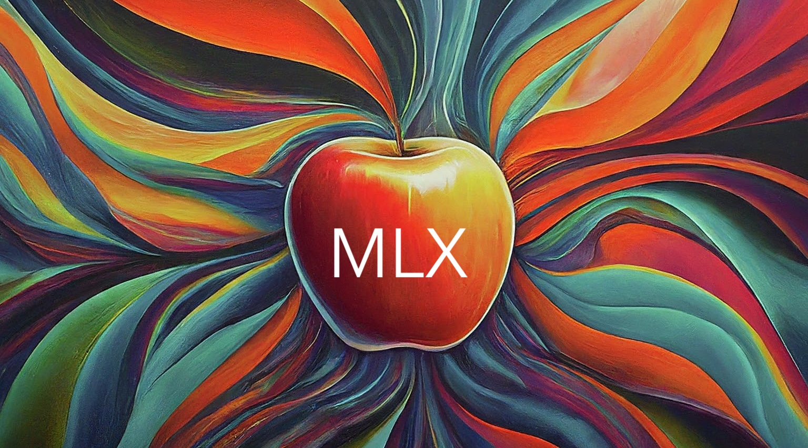
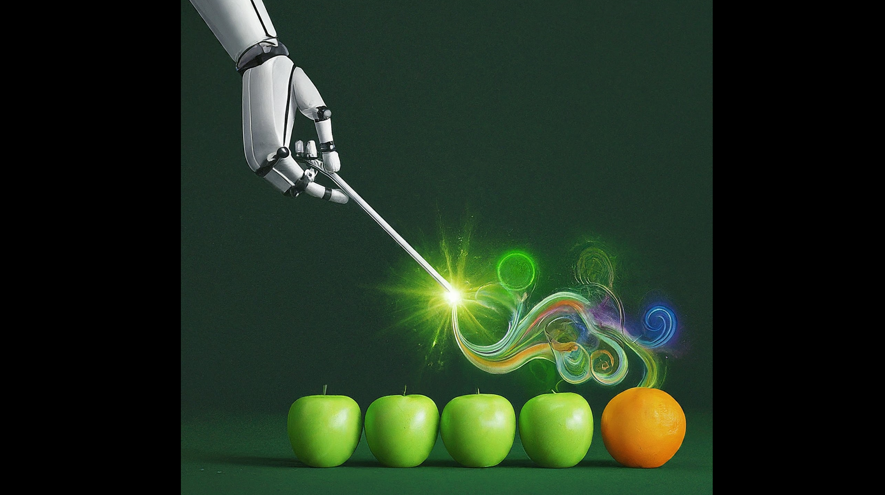

# Notes on the Apple MLX machine learning framework

## Apple MLX for AI/Large Language Models—Day One

<table><tr>
  <td><a href="2024/MLX-day-one.md"></a></td>
  <td>
  <a href="2024/MLX-day-one.md">Rendered markdown</a><br>
  <a href="https://www.linkedin.com/pulse/apple-mlx-ailarge-language-modelsday-one-oori-data-riiwc">LinkedIn version</a><br>
  <a href="2024/MLX-day-one.ipynb">Jupyter notebook</a>
  </td>
</tr></table>

## Converting models from Hugging Face to MLX format, and sharing

<table><tr>
  <td><a href="2024/conversion-etc.md"></a></td>
  <td>
  <a href="2024/conversion-etc.md">Rendered markdown</a><br>
  <a href="https://www.linkedin.com/pulse/converting-models-from-hugging-face-mlx-format-sharing-oori-data-6eitc">LinkedIn version</a><br>
  <a href="2024/conversion-etc.ipynb">Jupyter notebook</a>
  </td>
</tr></table>

## Retrieval augmentation with MLX: A bag full of RAG, part 1

<table><tr>
  <td><a href="2024/rag-basics1.md"></a></td>
  <td>
  <a href="2024/rag-basics1.md">Rendered markdown</a><br>
  <a href="https://www.linkedin.com/pulse/retrieval-augmentation-mlx-bag-full-rag-part-1-oori-data-tc83c">LinkedIn version</a><br>
  Jupyter notebook: In Progress…
  <!--
  <a href="2024/rag-basics1.ipynb">Jupyter notebook</a>
  -->
  </td>
</tr></table>

## Retrieval augmentation with MLX: A bag full of RAG, part 2

<table><tr>
  <td><a href="2024/rag-basics2.md"></a></td>
  <td>
  <a href="2024/rag-basics2.md">Rendered markdown</a><br>
  <a href="https://www.linkedin.com/pulse/retrieval-augmentation-mlx-bag-full-rag-part-2-oori-data-rgcxc">LinkedIn version</a><br>
  Jupyter notebook: In Progress…
  <!--
  <a href="2024/rag-basics1.ipynb">Jupyter notebook</a>
  -->
  </td>
</tr></table>

# More (up to date) MLX resources

<!-- ## Synchronizing markdown article & notebook formats -->

* [MLX home page](https://github.com/ml-explore/mlx)
* [Hugging Face MLX community](https://huggingface.co/mlx-community)
* [Using MLX at Hugging Face](https://huggingface.co/docs/hub/en/mlx)
* [MLX Text-completion Finetuning Notebook](https://github.com/mark-lord/MLX-text-completion-notebook)
* [MLX Tuning Fork—Framework for parameterized large language model (Q)LoRa fine-tuning using mlx, mlx_lm, and OgbujiPT. Architecture for systematic running of easily parameterized fine-tunes](https://github.com/chimezie/mlx-tuning-fork)

# A few general notes

* For the many chat formats already charted out in llama.cpp, see the `@register_chat_format` decorated functions in [llama_chat_format.py](https://github.com/abetlen/llama-cpp-python/blob/main/llama_cpp/llama_chat_format.py)

## To do, or figure out

* [any grammar/ebnf support a la llama.cpp](https://christophergs.com/blog/running-open-source-llms-in-python#grammar)?
* Alternate LLM sampling methods
* Steering vectors

# Syncing articles to notebooks

Use [Jupytext](https://jupytext.readthedocs.io/en/latest/) to convert the `.md` articles to `.ipynb` notebooks:

```sh
jupytext --to ipynb 2024/MLX-day-one.md
```

May have to convert cells using plain `pip` to use `%pip` instead. It also doesn't seem to check the format metadata, so you might need to convert non-Python cells back to Markdown by hand.

# License

Shield: [![CC BY 4.0][cc-by-shield]][cc-by]

This work is licensed under a
[Creative Commons Attribution 4.0 International License][cc-by].

[![CC BY 4.0][cc-by-image]][cc-by]

[cc-by]: http://creativecommons.org/licenses/by/4.0/
[cc-by-image]: https://i.creativecommons.org/l/by/4.0/88x31.png
[cc-by-shield]: https://img.shields.io/badge/License-CC%20BY%204.0-lightgrey.svg

See also: https://github.com/santisoler/cc-licenses?tab=readme-ov-file#cc-attribution-40-international
